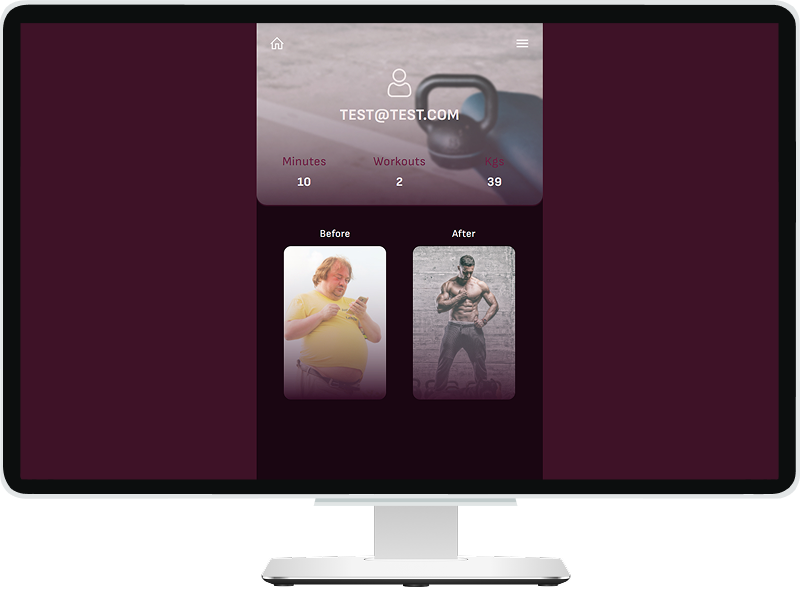

# Workout APP - frontend

### About

[](preview.png)

**"Workout APP"** is a workout tracking app. Frontend built with **React** and **Vite**. Users can create and manage workouts, log exercises, and track progress. Features include a personal dashboard, set and rep tracking, and a user-friendly interface. It is designed for fitness enthusiasts to stay organized and motivated!

### 🧩 Tech Stack


<details style="border:1px solid #d4d4d4; border-radius:2px; padding:1rem;">
<summary><h3 style="display:inline; padding-left:6px;">Dependencies:</h3></summary>

```bash
npm install gh-pages --save-dev
npm install sass
npm i react-icons --save
npm i clsx    # conditionally className
npm install react-router-dom
npm i @uidotdev/usehooks    # custom hooks
npm install --save-dev @trivago/prettier-plugin-sort-imports
npm install -D prettier
npm i react-hook-form
npm install axios
npm i @tanstack/react-query
npm i js-cookies
npm i react-select
```

</details>
<br />

### 📋 TODO
- [ ] .env variables
- [ ] Change folder *uploads* to *icons* on server+client sides

<br />
<br />

<details style="border:1px solid #d4d4d4; border-radius:2px; padding:1rem;">
<summary><h3 style="display:inline; padding-left:6px;">✅ Done:</h3></summary>

- [x] React router dom
- [x] Home page, bg images
- [x] Counters
- [x] Auth page style
- [x] Auth context
-	[x] Axios
-	[x] React Query
- [x] Cors
- [x] Notifications/~~Modal Messages~~
- [x] Redirect after log in
- [x] Log out
- [x] Profile page
- [x] Create new exercise
- [x] Create new workout
- [x] fix backLink
- [x] Workout page
  - [x] design
  - [x] get statistic
  - [x] workout log
  - [x] workouts list
  - [x] workout completed button
- [x] Exercise page:
  - [x] design
  - [x] exercise log
  - [x] isCompleted
  - [x] tasks log
    - [x] BUG: weight input rerenders after every digit 
    - [x] BUG: count of completed tasks / isCompleted Exercise
    - [x] BUG: input fields are unavailable after changing task status
- [x] BUG after login/registration: token created but can uses only after refresh

</details>


